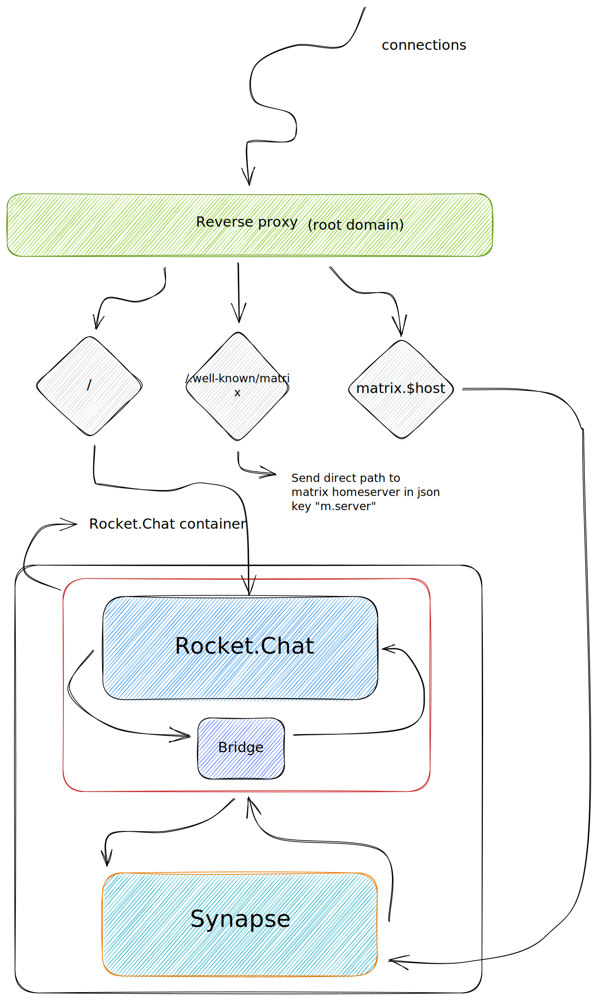
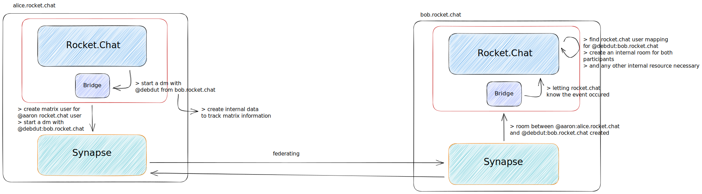

# Rocket.Chat x Matrix federation architecture

The following diagram shows an example of how Rocket.Chat's federation works.

## In layman's terms

By design, both matrix and rocket.chat servers sit under the same domain. 
This is primarily how you can federate from one rocket.chat instance to another.
With matrix, service discovery works via well-known, where a certain path returns the exact path of the homeserver instead of the given path.
In this case, `example.com` may be the homeserver domain, but the actual url is only given upon hitting `https://example.com/.well-known/matrix/server` - which would return a subdomain like `matrix.example.com:443` (with port).

## Flow example

Let's look at the flow of creating a DM

We have one server `alice.rocket.chat` with `@aaron` being one user of that workspace (Rocket.Chat), and another workspace `bob.rocket.chat` with `@debdut` being another user.

- `@aaron` requests a dm with `@debdut` over at `bob.rocket.chat`
- Rocket.Chat creates a matrix user under `matrix.alice.rocket.chat` for `@aaron` if can't find one
- The bridge asks the homeserver to create a room between two matrix users `@aaron:alice.rocket.chat` and `@debdut:bob.rocket.chat`
- Since the matrix homeservers, under the same network are federating with one another, they create the rooms as required
- on `bob.rocket.chat` the homeserver notifies the bridge of the room
- `bob.rocket.chat` finds the internally mapped user for `@debdut:bob.rocket.chat`
- Rocket.Chat creates the internal room and other resources
- Your direct message room kicks off

Here's an example diagram of the flow

