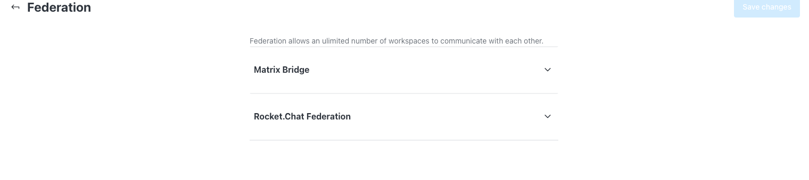
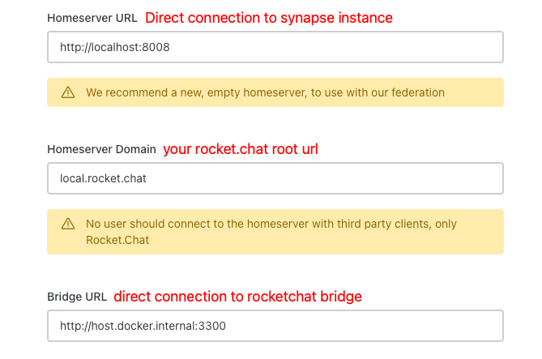
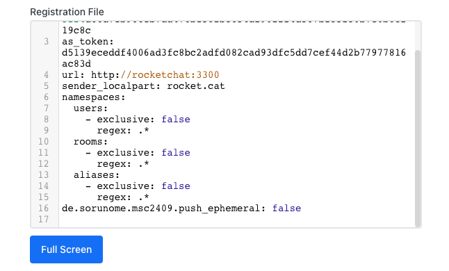

> This document explains the manual install method of Rocket.Chat with a Synapse homeserver for federation. 

> It uses docker as an example method but the process can be adopted to anything else (including podman). Recommended process is to use our helm chart (support for federation coming soon!).

> Make sure you have your CA certificate close by.

# Step 0: create a network

```sh
docker network create rocketchat
```

# Step 1: Deploy Synapse

The main config parameter we care about at this point is the `SYNAPSE_SERVER_NAME`.

Example config generation command -
```sh
docker run --rm -e SYNAPSE_SERVER_NAME=<host name> -e SYNAPSE_REPORT_STATS=yes -v $PWD/data:/data matrixdotorg/synapse generate
```

**Make sure the "host name" in this case is the same as Rocket.Chat's `ROOT_URL` value (except the protocol bit).**

The config `homeserver.yaml` file will be stored now in your current directory's "data" subdirectory.

Once it finishes, you can start up Synapse (we'll avoid using postgres and redis for now for simplicity's sake)

```sh
docker run --name synapse --network rocketchat -v $PWD/data:data:rw -v <path to your ca cert>:/ca_certificate.pem:ro -d matrixdotorg/synapse
```

> Adding a container name is very important.

# Step 2: Deploy RocketChat

Start mongodb

```sh
docker run --network rocketchat -d \
    --name "mongodb" \
    -e ALLOW_EMPTY_PASSWORD=yes -e MONGODB_REPLICA_SET_MODE=primary \
    -e MONGODB_REPLICA_SET_NAME=rs0 -e MONGODB_PORT_NUMBER=27017 \
    -e MONGODB_INITIAL_PRIMARY_HOST="mongodb" -e MONGODB_INITIAL_PRIMARY_PORT_NUMBER=27017 \
    -e MONGODB_ADVERTISED_HOSTNAME="mongodb" bitnami/mongodb:5.0
```

Star RocketChat

```sh
docker run --network rocketchat -d \
	--name "rocketchat" \
	-e ROOT_URL=https://<your domain> -e PORT=3000 \
	-e MONGO_URL=mongodb://mongodb:27017/rocketchat?replicaSet=rs0 -e MONGO_OPLOG_URL=mongodb://mongodb:27017/local?replicaSet=rs0 \
	registry.rocket.chat/rocketchat/rocket.chat
```

# Step 3: Configure matrix bridge

Start up your rocketchat server, head over to admin settings, search for "Federation".



Expand matrix bridge.



- homeserver url: should be a direct url to synapse, hostname with port. in this case the container name would be the hostname and the value would be `http://synapse:8008`
- homeserver domain: think of this as your rocket.chat root url's domain part. As both are under the same domain.
- bridge url: rocketchat runs a "bridge" server on port 3300 in the rocketchat container. Set this to your rocketchat container name with the port `http://rocketchat:3300`

# Step 4: reconfigure synapse

From the same matrix bridge view, copy the registration file contents



Save the file as `$PWD/data/registration.yaml` (in synapse container's data directory).

Now open `$PWD/data/homeserver.yaml` file and add the following

```yaml
app_service_config_files:
  - /data/registration.yaml

federation_custom_ca_list:
  - /ca_certificate.pem
```

Restart synapse
```sh
docker restart synapse
```

# Step 5: restart Rocket.Chat

Every time you change some setting in matrix bridge, the instance needs to be restarted

```sh
docker restart rocketchat
```

# Step 6: reverse proxy

Now you need to set up a reverse proxy to direct the traffic to the right service. Example nginx configuration below:

```conf
server {
	listen 443 ssl;

	server_name example.com;

	ssl_certificate /tls/example.com.pem;
    ssl_certificate_key /tls/example.com.key;

	add_header X-Frame-Options DENY;
	add_header X-Content-Type-Options nosniff;
	add_header X-XSS-Protection "1; mode=block";

	location /.well-known/matrix/server {
        default_type application/json;
        add_header Access-Control-Allow-Origin *;
		return 200 '{"m.server": "matrix.example.com:443"}';
	}

    location /.well-known/matrix/client {
        default_type application/json;
        add_header Access-Control-Allow-Origin *;
        return 200 '{"m.homeserver": {"base_url": "https://matrix.example.com"}}';
    }

    location / {
        proxy_set_header Host $host;
        proxy_set_header X-Forwarded-For $remote_addr;
        proxy_set_header X-Forwarded-Proto $scheme;
        proxy_pass http://rocketchat:3000;
    }
}

server {
    listen 80;

    server_name example.com;

    return 302 https://$server_name$request_uri;
}


server {
    listen 443 ssl;
    server_name matrix.example.com;
    ssl_certificate /tls/example.com.pem;
    ssl_certificate_key /tls/example.com.key;

	add_header X-Frame-Options DENY;
	add_header X-Content-Type-Options nosniff;
	add_header X-XSS-Protection "1; mode=block";

    location / {
        proxy_set_header X-Forwarded-For $remote_addr;
        proxy_set_header X-Forwarded-Proto $scheme;
        proxy_pass http://synapse:8008;
    }
}
```

For more info on why the config looks like this, read the [design](./DESIGN.md) document.